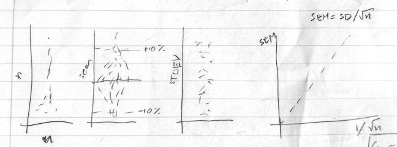
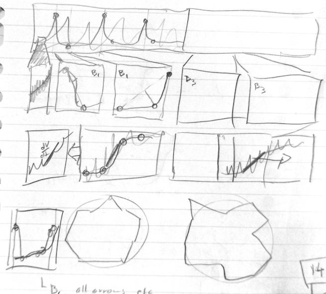
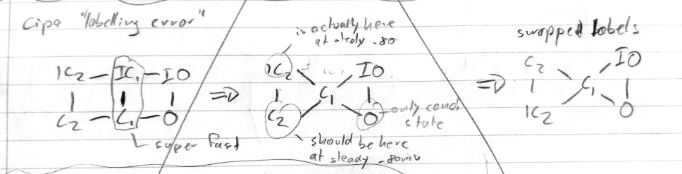

# General tip 1: Plan your figures

Making figures is much easier when you have a plan.

Unless you have a very clear idea in your mind (e.g. from preliminary work or other publications), use pen and paper to do some "rapid prototyping".

- Sketching on paper is much faster than using keyboard & mouse.
- Sketching helps you spot problems early.
- Knowing the layout tells you what size each component is going to be, which lets you draw it with appropriate line widths, fonts, level of detail etc.

## Examples

### Imaginary data

Example sketch including some imaginary data.
Drawing the results you expect can help you work out appropriate analyses.

### Complex layouts

Complex layouts take forever to set up, so try them all out on paper first. I ran out of steam around the 4th row, which was a clear sign I needed to rethink this figure.

### Diagrams

Little diagrams like this take seconds to sketch, but minutes to create as vector art.
Sketch until you get it right, then do the slow part once.
