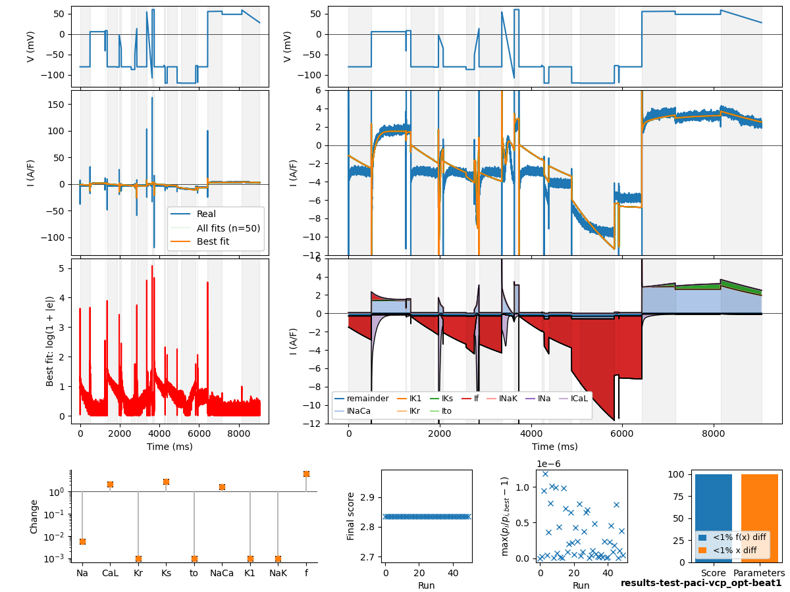
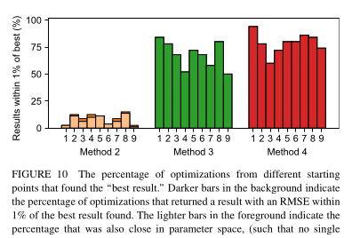
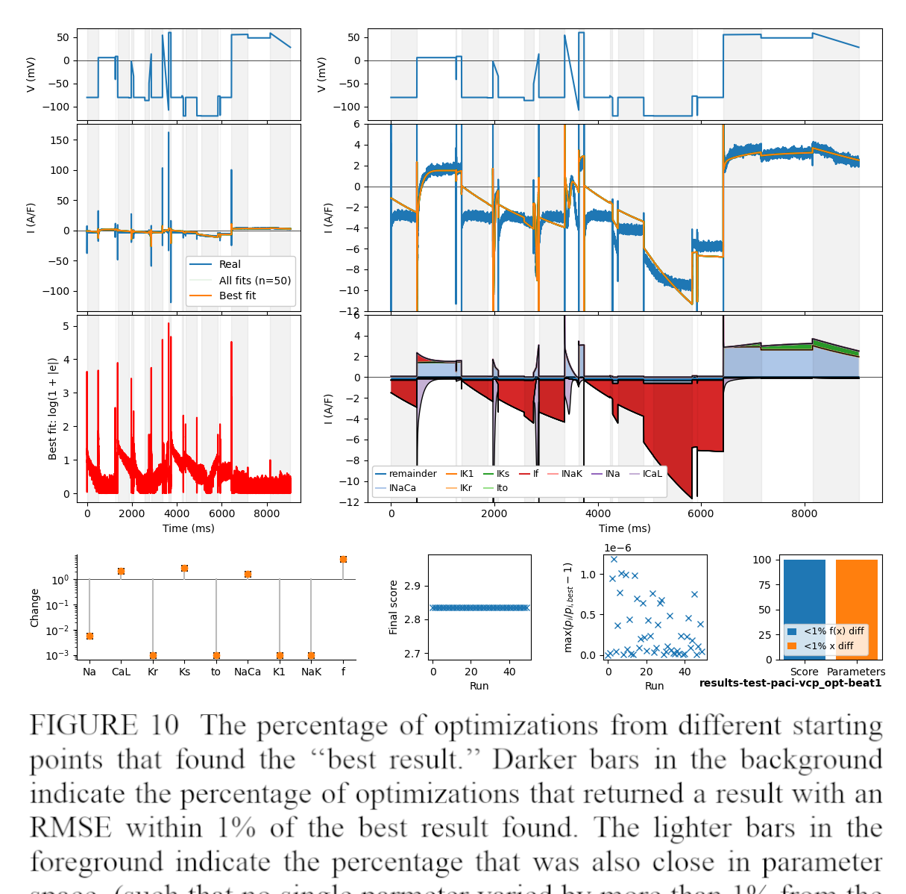
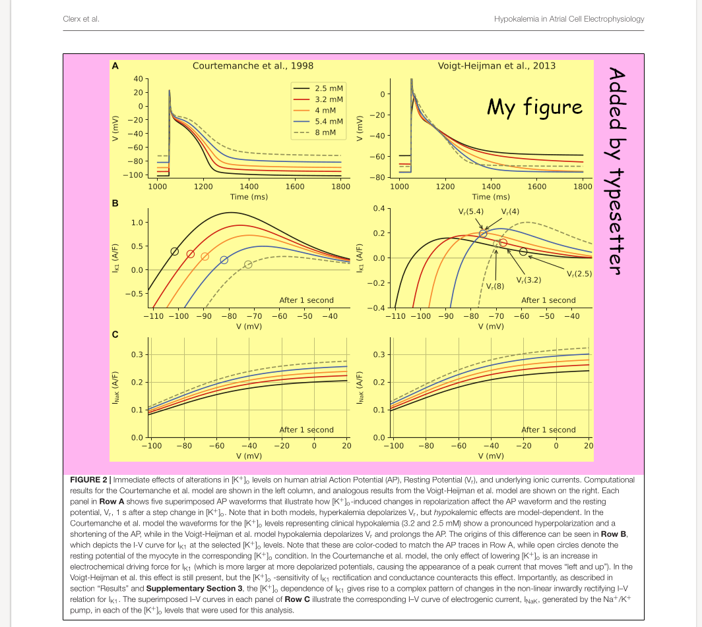
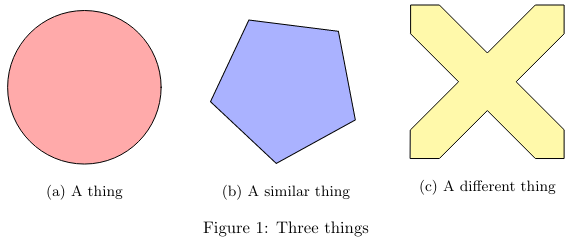

# General tip 2: Design for papers

### 2.1 Don't design for screen

Don't waste time designing figures that look good on screen, only to adapt them later.
You may even fall in love with your screen-designed figures, making it difficult to let go or have new ideas

### 2.2 Start with a fixed width

The first thing to do when making a figure is setting its width.
(Set the height to something big, trim down when finished).

In theory, you should look up or measure the widths of 1 column and 2 column figures in the journal guidelines.
In practice, just pick two approximate --- but consistent --- numbers.
This means your figures may get rescaled a little, but since it happens consistently your figures will still look great.

I've used e.g. 80mm for single and 170mm for double column figures, or 3 inches and 7 inches.

### 2.3 Pick a readable font size and use it throughout (e.g. Arial 10)
  
Setting a physical figure width (in mm or inches) makes the font size a meaningful number (1 pt = 1/12 inch).
For paper figures, anything below 8 or 9pt probably won't be readable, and anything bigger than 11.5pt can seem clumsy or oversized.

Be consistent, and use the same fonts, font sizes etc. in all figures of your paper.

### 2.4 Minimise whitespace around your figure

The article typesetter (or software) will take care of padding.

### 2.5 Avoid clever latex tricks (or word)

If you're writing a paper then keep your latex or word document simple.
Anything you do outside of writing is typesetting and will be redone by a professional typesetter before publication.
So avoid e.g. [latex subfigures](https://www.overleaf.com/learn/latex/How_to_Write_a_Thesis_in_LaTeX_(Part_3)%3A_Figures%2C_Subfigures_and_Tables#Subfigures) unless you are prepared to send lots of emails in the final publication stage.

In a thesis you can do whatever you like!

## Examples

### A figure designed for screen

I love this figure, but it is much too big (and busy) to go in a paper.

### Fixed widths help you get things right

The figure above was designed to fit in a single column.
As a result, the labels are readable and the line widths are good.
No tweaking was required: just choosing 10pt font and 1pt line width resulted in a readable figure.

A screen-designed figure crammed into the same space.
Obviously you wouldn't do this, but imagine the work needed to adapt this figure for print.
You'd have to redo the whole layout, probably remove some stuff, adapt all font sizes (possibly finding new positions for text labels).
Avoid by always designing for print.

"_But if I use vector graphics or a high DPI then people can just zoom in, it's the 21st century etc._".
Sure, and in some cases this is fine. But
- Large figures are difficult to read on phones, tablets, e-readers etc.
- Some scientists are older or visually impaired
- Editors want figures to look good in print
- Some journals are still read in print (especially medical ones)

### It's not your job to add padding

Padding gets added in the typesetting phase.
Leave it to the typesetter!

### Subfigures

Don't do this if you're writing a paper:

Just do this instead:

