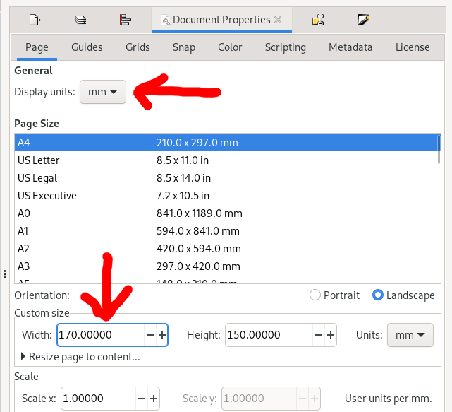

# Making diagrams with Inkscape

Inkscape is an open source tool to create vector art.

It uses the SVG format by default, but can open and export to several other formats.

Like most free software, it combines amazing capabilities with the occasional glaring bug.

- Use Ctrl+S to save as a matter of habit.
  - (if it does crash, it will sometimes make a back-up first!)
  - SVG is plain text, it works reasonably well with git (but forget about diff'ing, unless you have some kind of XML extension installed).
  - You can bother one of the maintainers on twitter (just use the word "inkscape" and eventually he'll show up).
  - Alternatives are costly (240 a year to adobve, for you [and your collaborators](https://en.wikipedia.org/wiki/Vendor_lock-in)).

Inkscape 1.1.2, running on Gnome/Fedora.

## Setting up inkscape

Inkscape has lots of customisation options, accessible through `Edit > Preferences`.

### Configuring the default grid

Edit the settings under `Interface > Grid` to define a regular grid in units you like.

The important settings here are "Spacing X" and "Spacing Y", which define the space between minor grid lines.
Use the "Major grid line every" setting to configure the number of minor grid lines that make up a major grid line.

Note that these are the default settings for _new grids_.
To add a grid to your current document, look under `File > Document properties` and find the `Grids` tab in the dialog.

### Enable snapping by default

Next, make sure that "snapping" is enabled by default:

### Show all the toolbars

Enable all toolbars:

### Configuring "step sizes"

The arrow keys can be used to move things around, but the amount they move is not automatically related to the grid.
To modify this, go to `Behavior > Steps` and find the setting "Arrow keys move by".
Set this to the minor grid spacing you defined in the previous step.

## Creating a first document

Let's try out our new settings.

First, create a new document.
Then go to `File > Document Properties`, find the `Page` tab, and set `Display units` to `mm` (or inches, but never pixels).

Set a figure width.
I often use 170mm for a two-column figure.

Now find the `Grids` tab and click `New` to add a new rectangular grid.

It should appear with the default settings you just configured.

# Stuff

On the right, in the snap toolbar, enable snapping to grids:

Also make sure snapping is enabled:

Now zoom in on the document (using Ctrl + scroll wheel), until you can see the minor grid lines.
Find the rectangle tool in the left toolbar, and draw a rectangle onto the grid points

The "origin"

- grid
- steps

Incomplete list of things I like to do first:

- On the "Grids" tab, add a nice rectangular grid e.g. with steps every 0.5mm and a thicker line every 2.5mm
- You can configure your grid as default in "Preferences"
- Another thing to look at in "Preferences" is Behaviour > Steps. Set this to the same as your grid so that arrow keys or Shift+Arrow keys move the objects without going off the grid.
- Make sure you have "snap" settings as in the tutorial above.

- Start with a fixed width. 
  - Use sensible font size e.g. 10.
  - Can even use same font as article?

### Starting a first document

- Open `File > Document Properties`, and set the "Display units" to "mm" (or inches)
- Set the width to whatever width the journal uses for a 2-column figure
- Set the height to something bigger - you'll adjust this later

- Enable the grid

