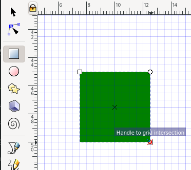

# Making diagrams with Inkscape

[Inkscape](https://inkscape.org/) is an open source tool to make [vector art](https://en.wikipedia.org/wiki/Vector_graphics).
"Ink", from octopusses, "scape" from land/sea/sound-scape.
On linux, install with `dnf` or `apt-get`.

Inkscape uses the SVG format by default, but can open and export to several other formats.

Like most free software, it combines amazing capabilities with the occasional glaring bug.

- Use Ctrl+S to save as a matter of habit.
  - If it does crash, it will sometimes make a back-up first.
  - SVG is plain text, it works reasonably well with `git`. But forget about diff'ing, unless you have some kind of git XML extension installed.
  - You can bother one of Inkscape's maintainers on twitter. Just use the word "inkscape" and within a week or so he'll show up.
  - Alternatives are costly (e.g. 240 a year to adobe, for you [and your collaborators](https://en.wikipedia.org/wiki/Vendor_lock-in)).

Inkscape 1.1.2, running on Gnome/Fedora.

## Setting up inkscape

Inkscape has lots of customisation options, accessible through `Edit > Preferences`.

### Configuring the default grid

Edit the settings under `Interface > Grid` to define a regular grid in units you like.

The important settings here are "Spacing X" and "Spacing Y", which define the space between minor grid lines.
Use the "Major grid line every" setting to configure the number of minor grid lines that make up a major grid line.

Note that these are the default settings for _new grids_.
To add a grid to your current document, look under `File > Document properties` and find the `Grids` tab in the dialog.

### Enable snapping by default

Next, make sure that "snapping" is enabled by default:

### Show all the toolbars

Enable all toolbars:

### Configuring "step sizes"

The arrow keys can be used to move things around, but the amount they move is not automatically related to the grid.
To modify this, go to `Behavior > Steps` and find the setting "Arrow keys move by".
Set this to the minor grid spacing you defined in the previous step.

## Creating a first document

Let's try out our new settings.

First, create a new document.
Then go to `File > Document Properties`, find the `Page` tab, and set `Display units` to `mm` (or inches, but never pixels).

Set a figure width.
I often use 170mm for a two-column figure.
Don't worry about the height, we can set that when the figure's done.

Now find the `Grids` tab and click `New` to add a new rectangular grid.

It should appear with the default settings you just configured.

Note that you can set a non-zero origin for the grid.
This can be useful to make the grid start a few mm from the edge of the "paper".

### Drawing a rectangle and moving it around

Now we're going to draw a rectangle on the grid.

On the right, in the snap toolbar, enable snapping to grids:

Also make sure snapping is enabled:

Now zoom in on the document (using Ctrl + scroll wheel), until you can see the minor grid lines.
Find the rectangle tool in the left toolbar, and draw a rectangle onto the grid points:

Now go back to the cursor tool (top-left).
The rectangle should now show resizing handles.
You can use these to transform the rectangle, or click again to get rotation handles.
You can use drag & drop to move the rectangle around.

But you can also use the arrow keys.
If the settings above were applied correctly, a single tap on an arrow key should now move the rectangle by exactly one grid distance.
Use `Shift+Arrow key` to move it by 10 grid distances.

### Copy-pasting

Now use `Ctrl+C` and `Ctrl+V` to create a copy of the rectangle.
Weirdly, the rectangle appears in a slightly random place.
You can drag-and-drop it back onto the grid with the mouse.

Alternatively (and this is really useful!), use `Ctrl+Alt+V` to paste the copy _in exactly the same place_.
You now have two perfectly overlapping rectangles, so you can only see one...
Use `Shift+Arrow keys` to move it to a new grid position.
Click a colour at the bottom of the screen to make the rectangle change colour.
Repeat a few times to draw a multicoloured tetris block:

