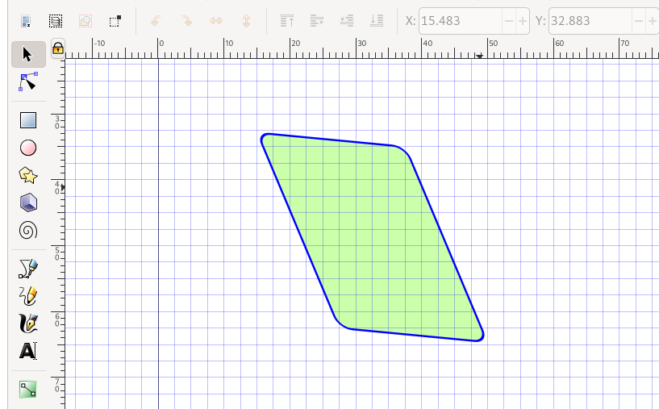
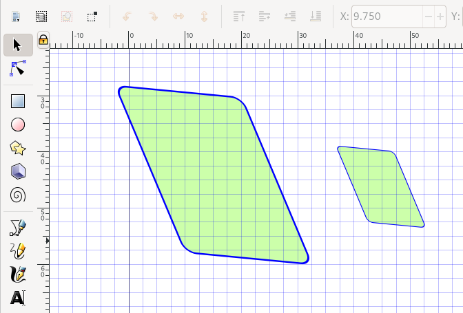

# Inkscape: Shapes, colours, and positioning

## Drawing shapes

Let's draw some rectangles.
As before, create a document, set a width, add a grid, and zoom in.

On the left, select the rectangle tool, and draw a rectangle!

Now use the colour buttons at the bottom of the screen to change its "Fill" colour.
You can also remove the fill by clicking the cross `X`, to the left of the colours.
Hold `Shift` and click a colour to set a "Stroke" colour.

Note that when you selected the rectangle tool, the toolbar near the top changed:

Use the `Rx` field to define a radius for the corners.
(You can set different x and y radii to get odd corners, but who needs that?)

Switch to the cursor tool if you want to resize or rotate the rectangle.
But notice that the thickness of the border changes too when you do this!
Click the rectangle twice to get the skew and rotation controls:

What have we done!
Although this is fun, we often want to be a bit more conservative when we resize things.
Hold `Ctrl` while resizing to maintain the original aspect ratio:

Holding `Ctrl` when creating a new rectangle makes it square:

Just below the rectangle tool, you'll find the circle tool.
By default, this makes nice ellipses, but if you hold `Ctrl` (and drag the mouse in roughly the right direction) it lets you make perfect circles.
Hold `Ctrl+Shift` to draw perfect circles _centered on the first point you clicked_.

As with the rectangle tool, selecting the circle tool changes the toolbar shown at the top.
You can use this to manually set the circle size (to manually set position, click the cursor tool, select the circle again, and use the new toolbar that's appeared).
You can also set circle start & end points here:

Use the toolbar buttons to change the way fill & stroke is applied to semi-circles:

Now let's try the line tool.
Pick a first point, and then a second, third, and so on.
Holding `Ctrl` lets you draw horizontal or vertical line segments.
To stop, do a right click anywhere on the page.

Depending on what your "Fill" and "Stroke" colours are, you should get something like these:

## Fill and stroke

Now let's play with fill and stroke in a bit more detail.
Clear the page (select items and hit `delete`, or use `Ctrl+A` to select all and hit delete just once).
Now use the line tool to draw a shape, e.g.:

Now open the `Fill and Stroke` dialog. 
You might already see it on the right of your screen, perhaps after toggling the dialogs on/off with F12.
If not, use the menu open `Objects > Fill and Stroke`.

Using this dialog, you can control the fill & stroke settings of your object in detail.
For example, to set a simple "flat color" as shown above.

The first thing you'll want to do, is set the colour picking tool to either [HSL or HSV](https://en.wikipedia.org/wiki/HSL_and_HSV).
HSV is my favourite.
In this mode of colour selection, you can quite easily find good colour combinations by leaving S (saturation) and V (for _value_, or brightness) fixed at their values, and simply varying H (hue).
(*Note that the human concept of "colour" is a lot more complex than this, for example "pink" and "brown" are certain hue/brightness/saturation combinations, while "golden" includes shinyness and highlights and whatnot.)

The fourth slider lets you set the "alpha" or transparency value.
This can give some nice effects, but requires some caution: many journals only accept `EPS` for vector graphics, and EPS does not support transparency.

At the bottom right you'll find an RGBA field where you can enter HEX codes.
This is particularly useful if you want to copy-paste colour values from other software.

Besides "flat color", you can also try using a (linear or radial) gradient.

Customising gradients is fiddly.
Select the gradient in the `Fill and Stroke` dialog, then select the path editing tool top-left (just below the cursor).
Now you can change the gradient orientation, and change the colour associated with each end (which also uses the Fill & Stroke dialog, so lots of potential for confusion).

A drawback of using fancier rendering options like these is that the gradient will have to be created by any viewer or printer that renders the file.
The more complicated the instruction, the less likely it is that the figure will always render the same.

### Customising stroke style

The `Stroke paint` panel lets you set a stroke colour the same way you did for the fill.
You can even use gradients here, to create lines that fade into nothing.
The next panel, `Stroke style` has more interesting options.

First, it lets you set line widths and line styles.
Try and define widths in physical units (pt, inch, mm) rather than pixels, and use only a handful of line widths in a single figure.

If you're using a patterned line style, e.g. with dashes, you can use the `offset` controls to the right of the line style selector to tweak where the dashes fall:

You can also add markers for the start, middle, and end of a line:

Unfortunately, this requires you to remember which was the start and end when you drew the line.
And arrow heads don't coincide with line endings, so some tweaking is often required to get nice results.

The `join` control lets you choose how corners are handled:

And the `cap` buttons let you control line ends:

Note that the three lines above have the same endpoints, and differ only in style.

Finally, if you mix fill and stroke (and start/mid/end markers), you can control their exact z-ordering with the last six buttons:

In this figure the same object is drawn twice.
Once with the stroke above the fill (left), and once with the fill above the stroke (right).

### Copy-pasting style

Styles can be copied and pasted!

To do this, select an item, copy it (`Ctrl+V`), select another item, and paste on the style using `Ctrl+Shift+V`.

This is particularly useful after resizing things (which scales line widths too).

For whatever reason, advanced properties such as stroke/fill z-order can not be copied this way.

## Fancy paths & bezier curves

Let's draw an ion current!
Select the line tool, and draw a path consisting of two line segments:

- Edit path
- "Cornering" settings
- Fun trick: noisy data
- Fun trick: Path intersections

## Text

- Text

## Positioning

After selecting an item with the cursor tool, you should also see mirror, flip and rotate buttons in the top toolbar (these let you mirror flip and rotate):

Finally, you can control which objects are displayed on top by changing their "Z-index", using the buttons indicated below:

- Organising
  - Grid
  - Move, snap to different bits
  - Z-index
  - Align & distribute
  - Guides

