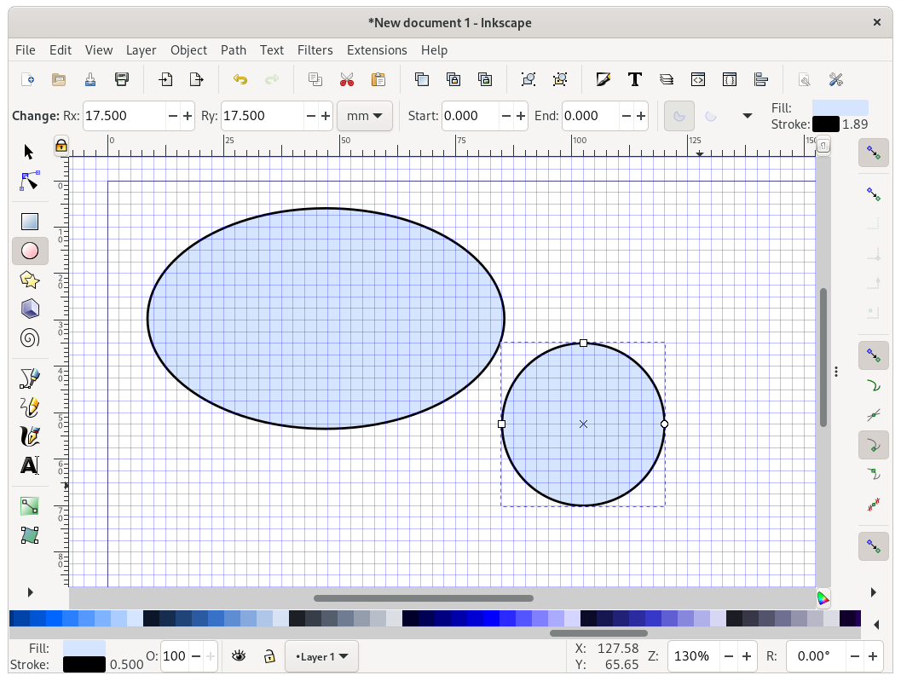
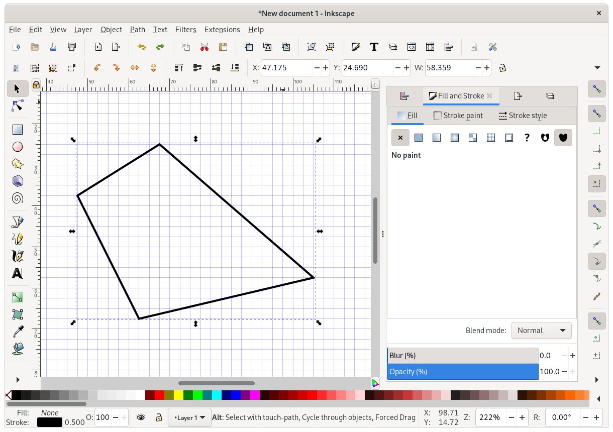
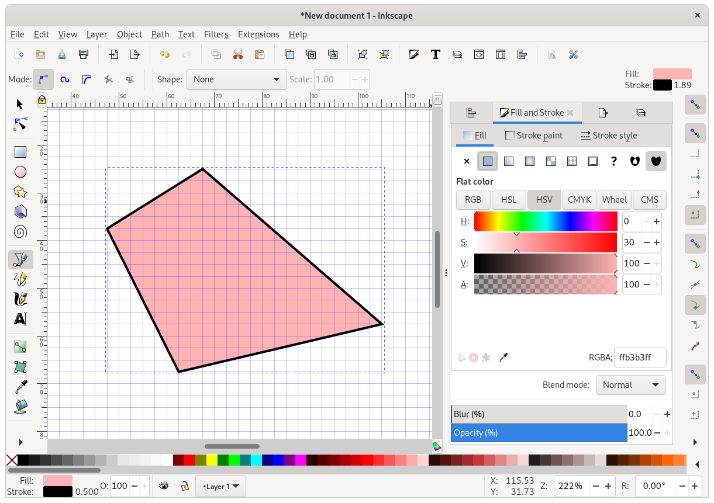

# Inkscape: Shapes, colours, and positioning

## Drawing shapes

Let's draw some rectangles.
As before, create a document, set a width, add a grid, and zoom in.

On the left, select the rectangle tool, and draw a rectangle!

Now use the colour buttons at the bottom of the screen to change its "Fill" colour.
You can also remove the fill by clicking the cross `X`, to the left of the colours.
Hold `Shift` and click a colour to set a "Stroke" colour.

Note that when you selected the rectangle tool, the toolbar near the top changed:

Use the `Rx` field to define a radius for the corners.
(You can set different x and y radii to get odd corners, but who needs that?)

Switch to the cursor tool if you want to resize or rotate the rectangle.
But notice that the thickness of the border changes too when you do this!
Click the rectangle twice to get the skew and rotation controls:

What have we done!
Although this is fun, we often want to be a bit more conservative when we resize things.
Hold `Ctrl` while resizing to maintain the original aspect ratio:

Holding `Ctrl` when creating a new rectangle makes it square:

Just below the rectangle tool, you'll find the circle tool.
By default, this makes nice ellipses, but if you hold `Ctrl` (and drag the mouse in roughly the right direction) it lets you make perfect circles.
Hold `Ctrl+Shift` to draw perfect circles _centered on the first point you clicked_.

As with the rectangle tool, selecting the circle tool changes the toolbar shown at the top.
You can use this to manually set the circle size (to manually set position, click the cursor tool, select the circle again, and use the new toolbar that's appeared).
You can also set circle start & end points here:

Use the toolbar buttons to change the way fill & stroke is applied to semi-circles:

Now let's try the line tool.
Pick a first point, and then a second, third, and so on.
Holding `Ctrl` lets you draw horizontal or vertical line segments.
To stop, do a right click anywhere on the page.

Depending on what your "Fill" and "Stroke" colours are, you should get something like these:

## Fill and stroke

Now let's play with fill and stroke in a bit more detail.
Clear the page (select items and hit `delete`, or use `Ctrl+A` to select all and hit delete just once).
Now use the line tool to draw a shape, e.g.:

Now open the `Fill and Stroke` dialog. 
You might already see it on the right of your screen, perhaps after toggling the dialogs on/off with F12.
If not, use the menu open `Objects > Fill and Stroke`.

Using this dialog, you can control the fill & stroke settings of your object in detail.
For example, to set a simple "flat color" as shown above.

The first thing you'll want to do, is set the colour picking tool to either [HSL or HSV](https://en.wikipedia.org/wiki/HSL_and_HSV).
HSV is my favourite.
In this mode of colour selection, you can quite easily find good colour combinations by leaving S (saturation) and V (for _value_, or brightness) fixed at their values, and simply varying H (hue).

(*The human concept of "colour" is a lot more complex than this, for example "pink" and "brown" are certain hue/brightness/saturation combinations, while "golden" includes shinyness and highlights and whatnot.)

The fourth slider lets you set the "alpha" or transparency value.
This can give some nice effects, but don't get carried away: many journals only accept the `EPS` format for vector graphics, which doesn't support transparency.

At the bottom right you'll find an RGBA field where you can enter HEX codes.
This is particularly useful if you want to copy-paste colour values from other software.

Besides "flat color", you can also try using a (linear or radial) gradient.

Customising gradients is fiddly.
Select the gradient in the `Fill and Stroke` dialog, then select the path editing tool top-left (just below the cursor).
Now you can change the gradient orientation, and change the colour associated with each end (which also uses the Fill & Stroke dialog, so lots of potential for confusion).

A drawback of using fancier rendering options like these is that the gradient will have to be created by any viewer or printer that renders the file.
The more complicated the instruction, the less likely it is that the figure will always render the same.

### Customising stroke style

The `Stroke paint` panel lets you set a stroke colour the same way you did for the fill.
You can even use gradients here, to create lines that fade into nothing.
The next panel, `Stroke style` has more interesting options.

First, it lets you set line widths and line styles.
Try and define widths in physical units (pt, inch, mm) rather than pixels, and use only a handful of line widths in a single figure.

If you're using a patterned line style, e.g. with dashes, you can use the `offset` controls to the right of the line style selector to tweak where the dashes fall:

You can also add markers for the start, middle, and end of a line:

Unfortunately, this requires you to remember which was the start and end when you drew the line.
And arrow heads don't coincide with line endings, so some tweaking is often required to get nice results.

The `join` control lets you choose how corners are handled:

And the `cap` buttons let you control line ends:

Note that the three lines above have the same endpoints, and differ only in style.

Finally, if you mix fill and stroke (and start/mid/end markers), you can control their exact z-ordering with the last six buttons:

In this figure the same object is drawn twice.
Once with the stroke above the fill (left), and once with the fill above the stroke (right).

### Copy-pasting style

Styles can be copied and pasted!

To do this, select an item, copy it (`Ctrl+V`), select another item, and paste on the style using `Ctrl+Shift+V`.

This is particularly useful after resizing things (which scales line widths too).

For whatever reason, advanced properties such as stroke/fill z-order can not be copied this way.

## Text

Text can be inserted in two ways:

If you select the text tool and click anywhere on the page, you can add text that flows wherever it can.
If instead you drag a box, the text will remain inside the box.

Note that the box surrounding the text in the example below has gone red to indicate that the text doesn't fit!

The toolbar that shows up when the text tool is selected lets you change font, font size, line spacing etc.

Working with text in Inkscape can be quite annoying.
For example, the alignment tool sometimes stops working, and sometimes settings don't seem to get applied unless I select all the text first.

## Fancy paths & bezier curves

Let's draw an ion current!
Select the line tool, and draw a path consisting of two line segments:

Now select the `Edit path by nodes` tool, and select the path you just drew.

Click the center of a line segment, and drag it along a bit!
Do this for both lines:

Hurray! We've turned out straight line into a [Bezier curve](https://en.wikipedia.org/wiki/B%C3%A9zier_curve).

The current selection shows 3 "nodes", connected by 2 "segments".
If we click one of the line segments again, Inkscape will also show the "handles" at each node (indicated by circles).
You can move these about to mess with the curvature:

Like nodes, handles can "snap" to the grid, so that we can set them with some precision.
The angle that a handle makes with its node determines the curvature at one of the line line segment.
The lengths of the handles determine the weighting between the line segment's two curvatures.
We can mess around a bit until we have something almost acceptable:

To make it look more like an ion current, we'll need to move the middle point a bit more towards the left.

This can be fiddly!
If you select a line segment, and then drag a node, the whole line segment will move!
If you end up in this situation, undo with `Ctrl+Z`, and then click the node first to select it.
Now you should be able to move just the node (and its handles).

On the left, the whole line segment is selected.
On the right, only the middle node is selected.

Move the node a bit to the left, and adjust the handles, to get something that looks more like an ion current.
If you want, move the top-right node too, to add a non-zero steady state current.

This is better, but the right segment still doesn't look quite right.
We can try adding more detail by adding a new point.
Select the right segment, and click `Insert new nodes into line segment`, top-left in the toolbar.

This gives us some extra degrees of freedom to play with.
If your Inkscape is set up like mine, there will be an interesting difference between the new node and the previous ones: both handles have the same curvature!
The buttons highlighted below let you adapt this behaviour per node:

- corner: Both handles are indepdent, letting you can make sharp edges.
- smooth: Both handles have the same curvature, letting you make smooth curves.
- symmetric: Both handles have the same curvature and length.
- auto-smooth: Like smooth, but smooths the curve for you any time you click it.

"Corner" and "smooth" are most useful for our purposes.

The buttons to the left are also worth exploring.
These let you add nodes, delete line segments between nodes, etc.

After some messing about (you may want to disable snapping during this), you might find a nice curve.
Or you may find that it was easier without this new point!
No worries, just delete it again by selecting and hitting the `Delete selected nodes` button next to the `Insert nodes` one.

Maybe if we try tracing an existing image?
Click `File > Import`, find the file `ina.png` in this repo, and double click to open.
Inkscape will ask you if you want to embed or link to this file.
Usually you'll want to embed (meaning the image will be stored as part of the SVG file), but for now it doesn't matter: we'll delete this imported file again in a few moments.

Now we've created a raster/vector hybrid!
Use the Z-index buttons near the top to move the raster image underneath our line.
Next, resize the image until it approximately fits.

Maybe it wasn't such a bad effort after all.
Make a few tweaks and delete the image again.

Now let's use some of Inkscape's crazier features.

First, we'll need a back up.
Select the cursor tool, click your path, and use `Ctrl+C` and `Ctrl+Alt+V` to create a copy in place.
Use `Shift+Arrow keys` to move the copy down.

Now go to `Extensions > Modify path > Add nodes`.

Select `By max. segment length` and `Maximum segment length(px): 0.1`, and hit `Apply`.

Now reselect the `Edit path` tool to see what you have done:

Now got to `Extensions > Modify path > Jitter`.
Set a maximum x displacement of 0, and set y to e.g. `3.0 px`.
Make sure `Distribution` is set to `Gaussian` and hit `Apply`.

Switch back to the cursor tool and use `Shift+Arrow keys` to make the curve overlap with our back-up.
Use the z-index controls to make sure the noisy curve is behind the smooth one, and set some nice stroke colours for each.
You may also want to reduce the stroke size of the noisy curve.

Congratulations! You've fitted an ion current 🤔

