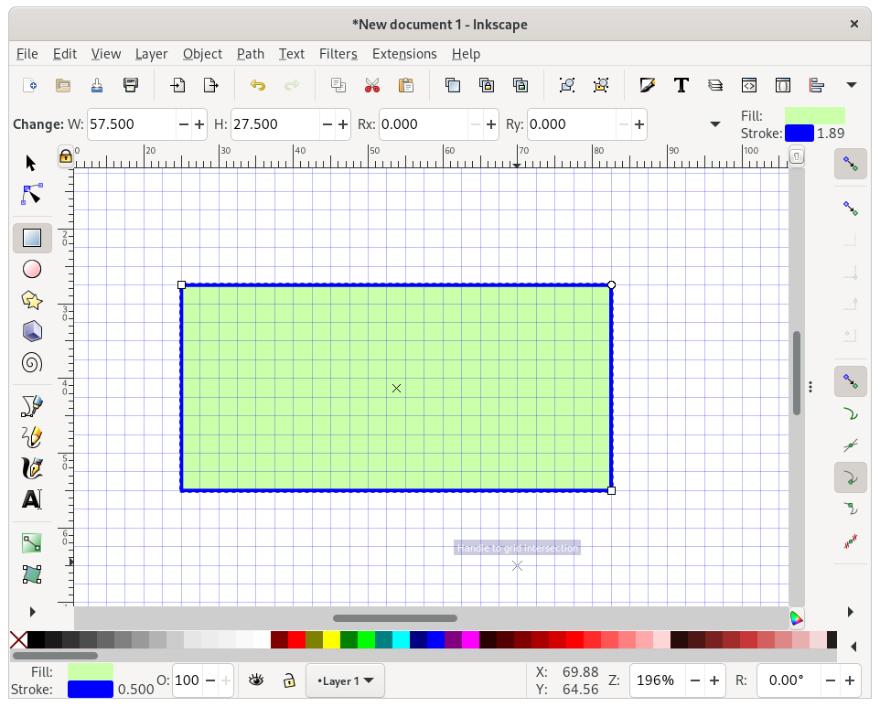
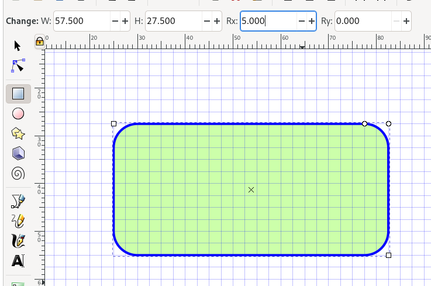
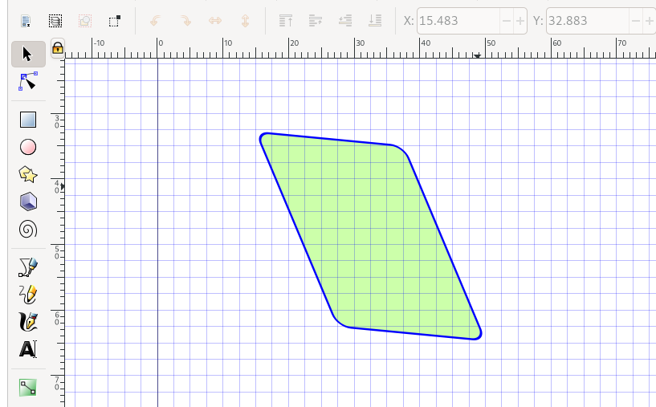
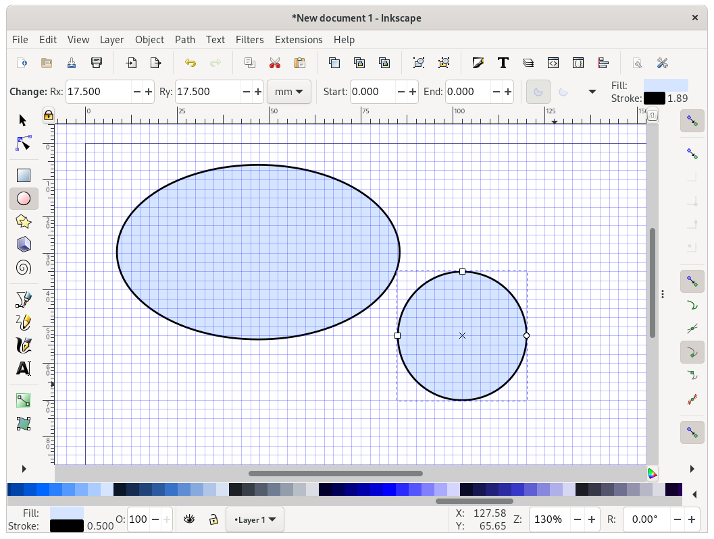
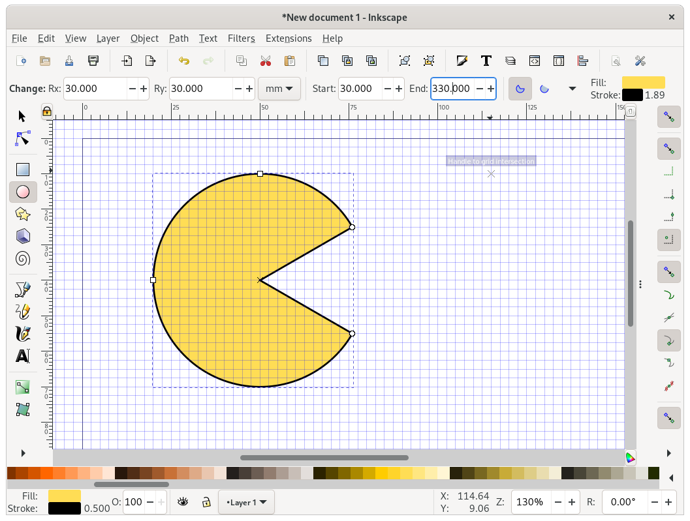
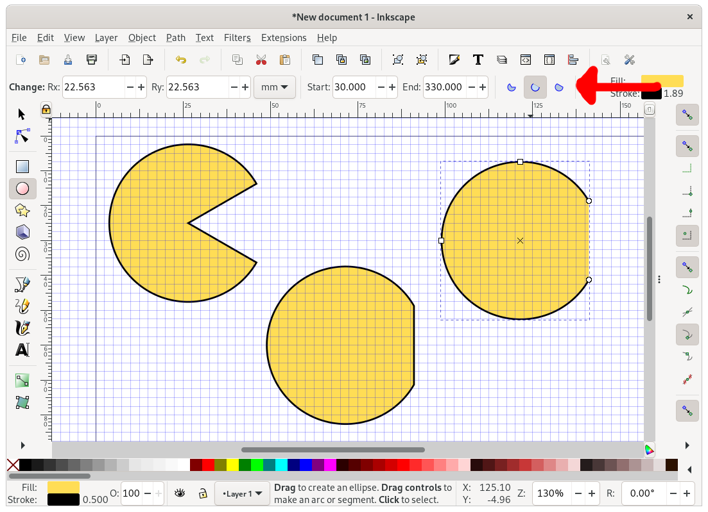
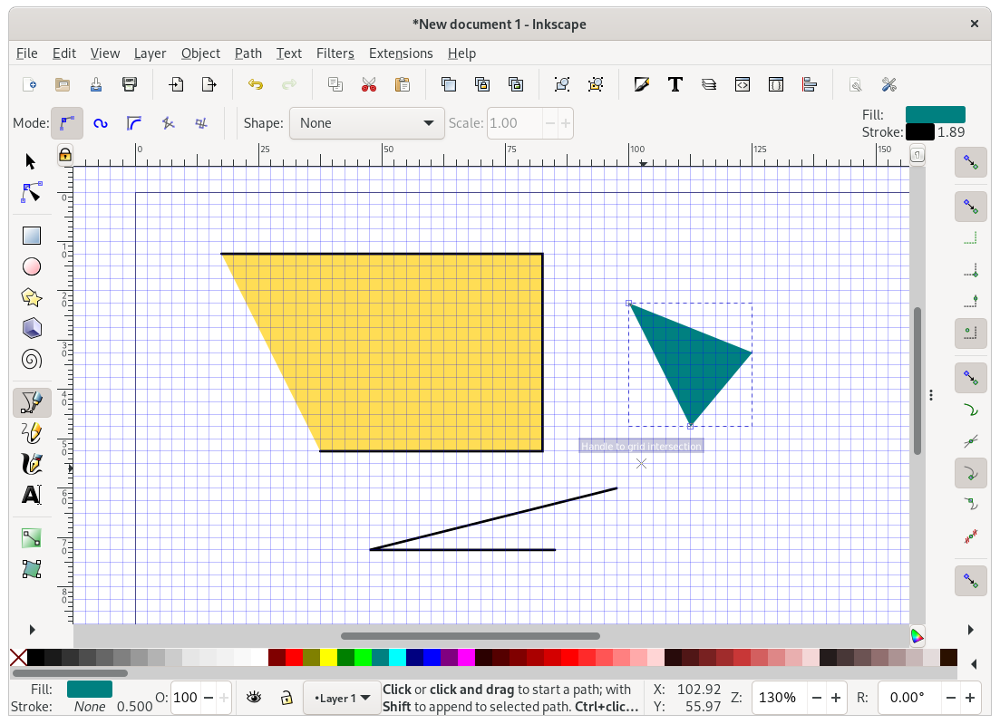
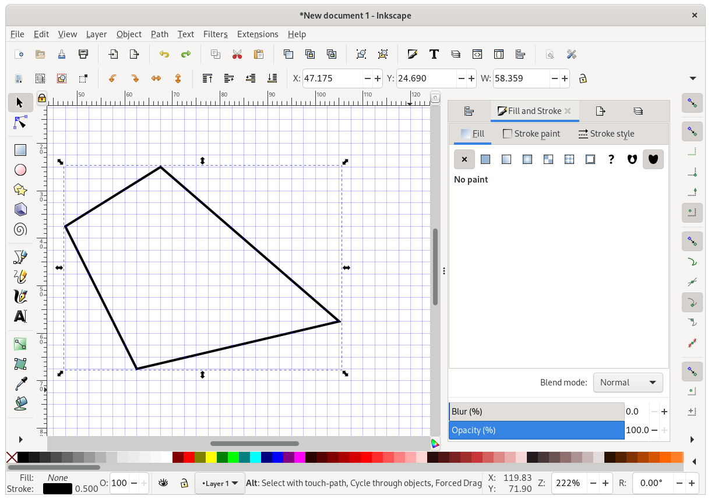
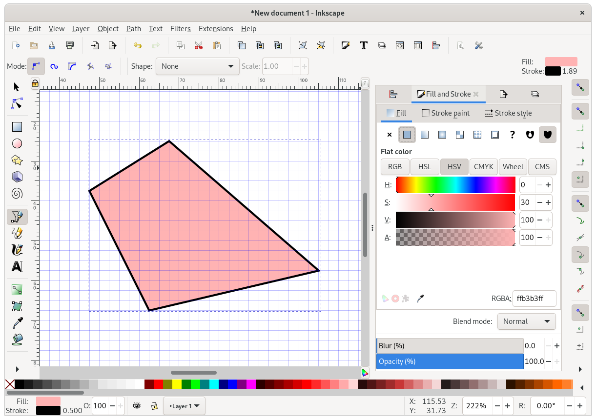

# Inkscape: Shapes, colours, and positioning

## Drawing shapes

Let's draw some rectangles.
As before, create a document, set a width, add a grid, and zoom in.

On the left, select the rectangle tool, and draw a rectangle!

Now use the colour buttons at the bottom of the screen to change its "Fill" colour.
You can also remove the fill by clicking the cross `X`, to the left of the colours.
Hold `Shift` and click a colour to set a "Stroke" colour.

Note that when you selected the rectangle tool, the toolbar near the top changed:

Use the `Rx` field to define a radius for the corners.
(You can set different x and y radii to get odd corners, but who needs that?)

Switch to the cursor tool if you want to resize or rotate the rectangle.
But notice that the thickness of the border changes too when you do this!
Click the rectangle twice to get the skew and rotation controls:

What have we done!
Although this is fun, we often want to be a bit more conservative when we resize things.
Hold `Ctrl` while resizing to maintain the original aspect ratio:

Holding `Ctrl` when creating a new rectangle makes it square:

Just below the rectangle tool, you'll find the circle tool.
By default, this makes nice ellipses, but if you hold `Ctrl` (and drag the mouse in roughly the right direction) it lets you make perfect circles.
Hold `Ctrl+Shift` to draw perfect circles _centered on the first point you clicked_.

As with the rectangle tool, selecting the circle tool changes the toolbar shown at the top.
You can use this to manually set the circle size (to manually set position, click the cursor tool, select the circle again, and use the new toolbar that's appeared).
You can also set circle start & end points here:

Use the toolbar buttons to change the way fill & stroke is applied to semi-circles:

Now let's try the line tool.
Holding `Ctrl` lets you draw horizontal or vertical lines.
Depending on what your "Fill" and "Stroke" colours are, you should get something like these:

## Fill and stroke

Now let's play with fill and stroke in a bit more detail.
Clear the page (select items and hit `delete`, or use `Ctrl+A` to select all and hit delete just once).
Now use the line tool to draw a shape, e.g.:

Now open the `Fill and Stroke` dialog. 
You might already see it on the right of your screen, perhaps after toggling the dialogs on/off with F12.
If not, use the menu open `Objects > Fill and Stroke`.

Using this dialog, you can control the fill & stroke settings of your object in detail.
For example, to set a simple "flat color" as shown above.

  - Gradients? (Careful!)
  - Line endings (arrows)
  - Cap, join, order
- Copy-paste a style with Ctrl-Shift-V
  

## Fancy paths & bezier curves
- Edit path
- "Cornering" settings
- Fun trick: noisy data
- Fun trick: Path intersections

## Text

- Text

## Positioning

- Organising
  - Grid
  - Move, snap to different bits
  - Z-index
  - Align & distribute
  - Guides

