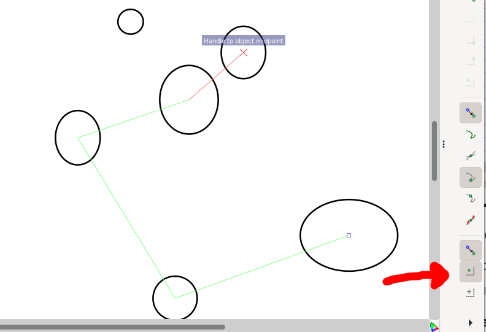

# Inkscape: More drawing

## Drawing on a grid

Using the grid lets you easily draw shapes that are similar sizes, and look "tidy", if not very artistic.

## Going off the grid

To draw more complex shapes, we can use the snapping feature.

In the example below I've drawn a plus sign on the grid, then disabled snap-to-grid before resizing and moving it.

We'll now make a 3d shape.
First, copy the plus sign and move it about a bit.
I've given the plus a white fill to hide what's behind it.

Now, make sure that snapping to "cusp nodes" is enabled, and draw a squinty rectangle connecting the two plus signs:

Do the same thing to create a "side".
I've used different stroke colours to differentiate tops and sides from the original plus.

For the remaining two parts we need something slightly more complicated.
Select "Snap to path intersections" from the snapping toolbar and add in the shape top-right...

...and bottom left.
You can now delete the plus at the back (it's fully obscured by the other shapes), and use `Ctrl+Shift+V` to give all parts the same style.

Finally, choose a strong fill colour for the plus in the front.
Then use the "S" or "V" controls to select a weaker colour for the sides, and one for the tops.

There's more snapping options, e.g. snapping to object centers:

## Distribute and align

The "Align and Distribute" dialog lets you change objects positions (to distribute or align them).
Open it by selecting `Object > Align and Distribute` from the menu, or with `Ctrl+Shift+A`.

In the example below I've made three copies of a circle (without using the grid).

Select them all and click `Center on horizontal axis`:

Note the `Relative to: first selected` setting in the dialog.
I selected the circle on the left first, so all circles get its y coordinate.

Next, `Distribute centers equidistantly horizontally`:

You can use the same tools to place text in the center of objects, but it doesn't always work brilliantly (for short texts the object's center doesn't match its visual centre very well).
Before tweaking:

And after some tweaking with the left & right arrows:

Use `Alt+Arrow key` to make very small adjustments.

## Example: Drawing a kinetic scheme

We'll now draw a little kinetic scheme (or "Markov model"), starting from the sketch below:

Start by adding the text in a 10pt font (using a separate text object for every label).
This gives us a sense of scale.

We can use `Align and Distribute` to space them evenly:

Or we can try to find grid positions that look good:

In this example I've used `snapping to object rotation center` to snap the center of the letters to grid points.
If you have multiple snapping methods enabled, Inkscape picks one based on your cursor location, so I've made sure to click near the center of the letters whenever I selected them.

To get even spacing without counting grid lines, I've drawn a rectangle and copied+moved it.

Next, draw a reaction arrow between two states.

Copy-paste and flip (or rotate) to add another.
By convention, the left-to-right one goes on top.

Some more copy-pasting gives us all the horizontal arrows, nicely arranged on the grid.

But this doesn't look great, so we manually adjust the arrows on the right.
We still want the arrows to be directly above each other, so this involves finding some compromise that works for the top and bottom rows.

Now we make another copy, and use rotate:

Woops!
Inkscape has rotated both arrows independently, which looks weird.
We can manually adjust the arrow locations to correct this.

An alternative solution is to use *grouping*: select both arrows and select `Object > Group` or use `Ctrl+G`.
Now we can rotate the group of two arrows, preserving their original relationships:

The convention for the arrow orientation here is that in any loop there should be an "inner loop" and "outer loop" where all arrows point in the same direction.

If you like, ungroup the arrows again with `Ctrl+Shift+G`.

Some more copy-pasting and we have arrows everywhere:

Again, this looks a bit off.
In fact, since the group of arrows is three grid units wide, we can't center it using the grid!
We can solve this by choosing a finer grid, using "Align", or by manual tweaking:

These arrows look more cramped than the horizontal ones, and by rotating our spacer we can easily see why.
We could solve this by making the arrows shorter (by editing their paths, not by rescaling) or by spacing the rows further apart, but in this example we'll leave it as it is.

