# Inkscape: Paths

Let's draw an ion current!
In particular, let's redraw something like the top-left figure in [this image](https://github.com/pints-team/pints/blob/master/example.svg).

Select the line tool, and draw a path consisting of two line segments:

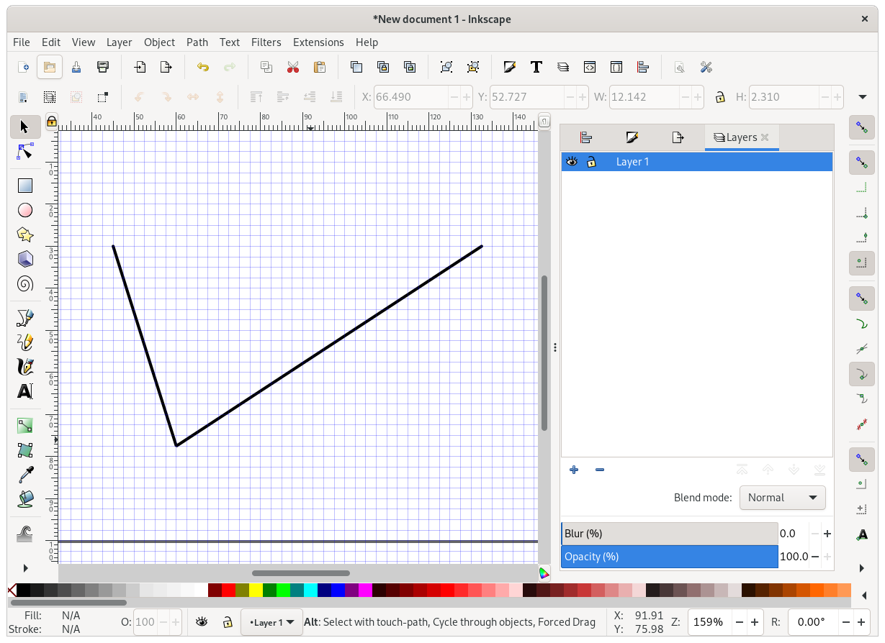

Now select the `Edit path by nodes` tool, and select the path you just drew.

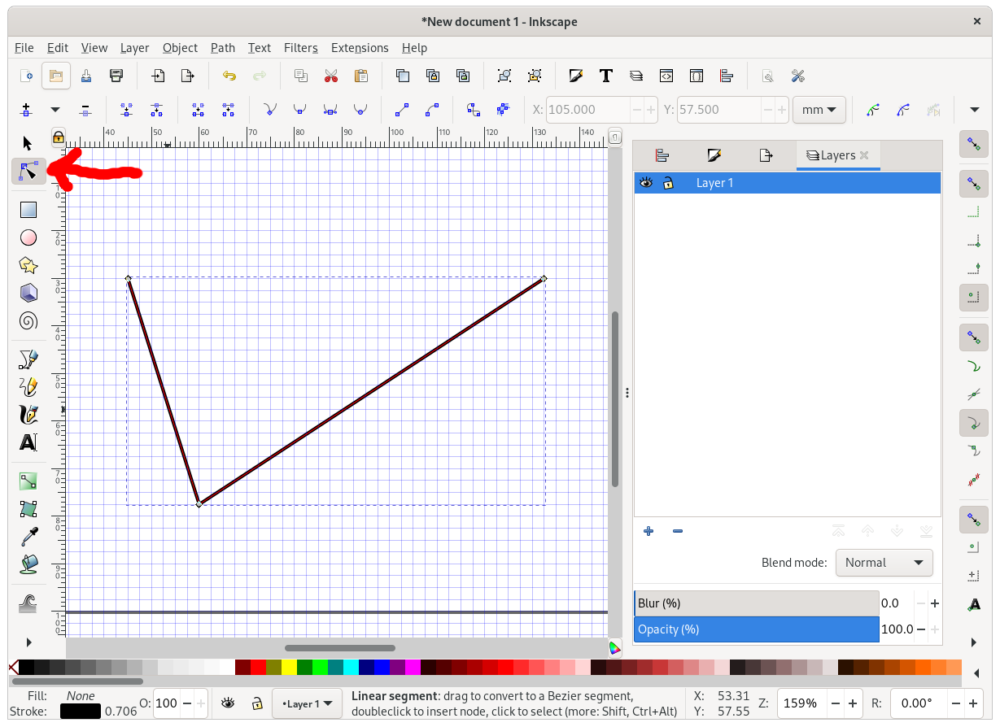

Click the center of a line segment, and drag it along a bit!
Do this for both lines:

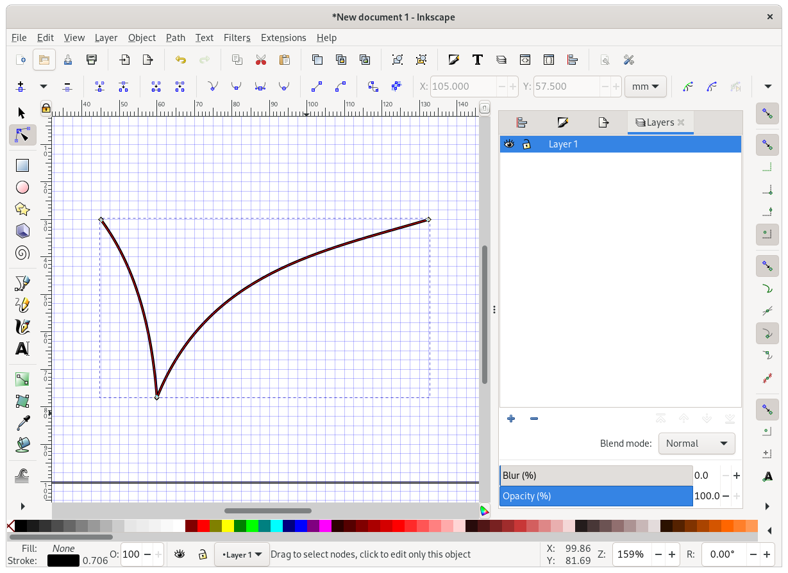

Hurray! We've turned our straight line into a [Bezier curve](https://en.wikipedia.org/wiki/B%C3%A9zier_curve).

The current selection shows 3 "nodes", connected by 2 "segments".
If we click one of the line segments again, Inkscape will also show the "handles" at each node (lines ending in open circles).
You can move these about to mess with the curvature:

Like nodes, handles can "snap" to the grid, so that we can set them systematically.
At each end, the line segment will be tangential to its handles.
In between, the curvature varies smoothly, at a rate set by the ratio between the handle lengths.

We can mess around a bit until we have something almost acceptable:

To make it look more like an ion current, we'll need to move the middle point a bit more towards the left.

This can be fiddly!
If you select a line segment, and then drag a node, the whole line segment will move!
If you end up in this situation, undo with `Ctrl+Z`, and then click the node first to select it.
Now you should be able to move just the node (and its handles).

On the left, the whole line segment is selected.
On the right, only the middle node is selected.

Move the node a bit to the left, and adjust the handles, to get something that looks more like an ion current.
If you want, move the top-right node too, to add a non-zero steady state current.

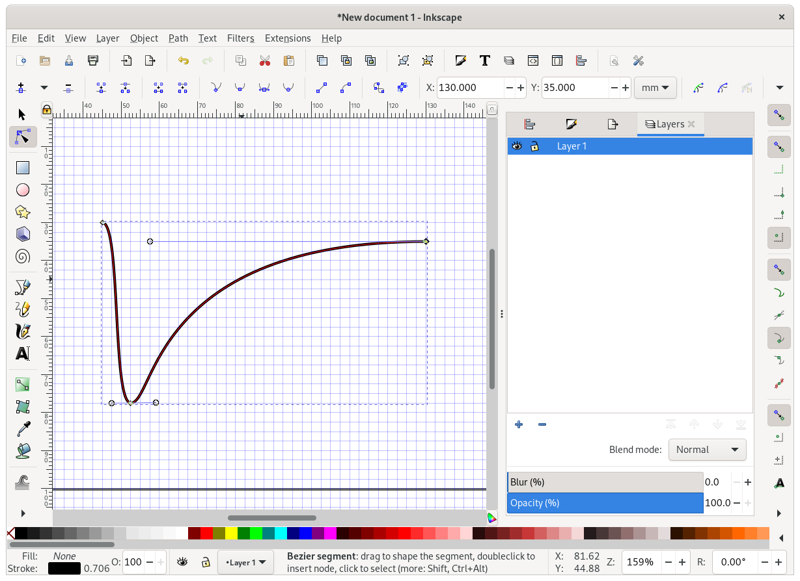

This is better, but the right segment still doesn't look quite right.
We can try adding more detail by adding a new point.
Select the right segment, and click `Insert new nodes into line segment`, top-left in the toolbar.

This gives us some extra degrees of freedom to play with.
If your Inkscape is set up like mine, there will be an interesting difference between the new node and the previous ones: both handles have the same curvature!
The buttons highlighted below let you adapt this behaviour per node:

- corner: Both handles are indepdent, letting you can make sharp edges.
- smooth: Both handles have the same curvature, letting you make smooth curves.
- symmetric: Both handles have the same curvature and length.
- auto-smooth: Like smooth, but smooths the curve for you any time you click it.

"Corner" and "smooth" are most useful for our purposes.

The buttons to the left are also worth exploring.
These let you add nodes, delete line segments between nodes, etc.

After some messing about (you may want to disable snapping during this), you might find a nice curve.
Or you may find that it was easier without this new point!
No worries, just delete it again by selecting and hitting the `Delete selected nodes` button next to the `Insert nodes` one.

Maybe if we try tracing an existing image?
Click `File > Import`, find the file `ina.png` in this repo, and double click to open.
Inkscape will ask you if you want to embed or link to this file.
Usually you'll want to embed (meaning the image will be stored as part of the SVG file), but for now it doesn't matter: we'll delete this imported file again in a few moments.

Now we've created a raster/vector hybrid!
Use the Z-index buttons near the top to move the raster image underneath our line.
Next, resize the image until it approximately fits.

Maybe it wasn't such a bad effort after all.
Make a few tweaks and delete the image again.

## Using extensions to emulate a noisy signal

Now let's use some of Inkscape's crazier features.

First, we'll need a back up.
Select the cursor tool, click your path, and use `Ctrl+C` and `Ctrl+Alt+V` to create a copy in place.
Use `Shift+Arrow keys` to move the copy down.

Now go to `Extensions > Modify path > Add nodes`.

Select `By max. segment length` and `Maximum segment length(px): 0.1`, and hit `Apply`.

Now reselect the `Edit path` tool to see what you have done:

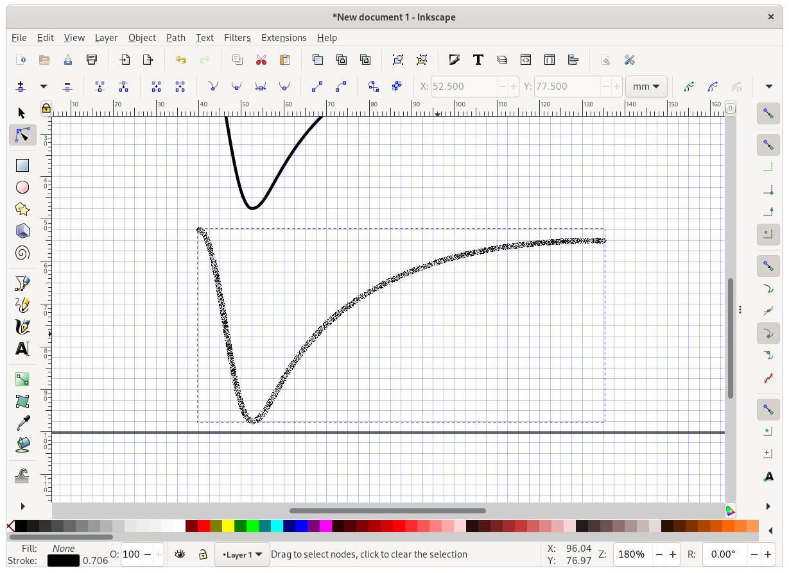

Now got to `Extensions > Modify path > Jitter`.
Set a maximum x displacement of 0, and set y to e.g. `3.0 px`.
Make sure `Distribution` is set to `Gaussian` and hit `Apply`.

Switch back to the cursor tool and use `Shift+Arrow keys` to make the curve overlap with our back-up.
Use the z-index controls to make sure the noisy curve is behind the smooth one, and set some nice stroke colours for each.
You may also want to reduce the stroke size of the noisy curve.

Congratulations! You've fitted an ion current 🤔

## Comparing paths to create a "zoom" effect.

Next, we'll create a little zoom panel.

First, draw a little circle on an area you want to zoom in on, and set a nice stroke (no fill):

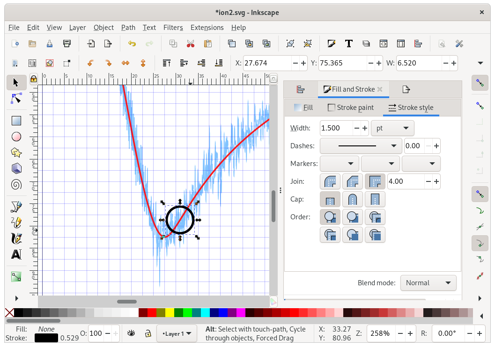

Next, select all three parts (smooth line, noisy line, circle), copy and paste-in-place (`Ctrl+Alt+V`), and move the copies some distance away with `Shift+Arrow keys`.
We'll do it this way instead of with the mouse, so that we can repeat the exact same movements later!
Do this twice, to create two copies:

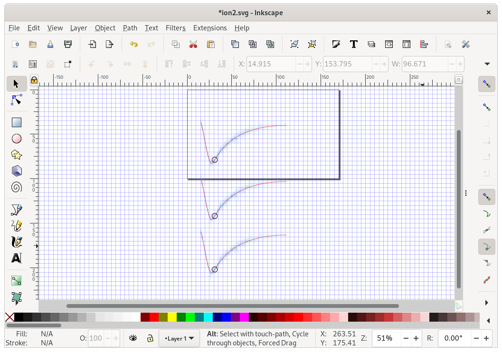

Now zoom in on one of the copies, and delete the noisy line:

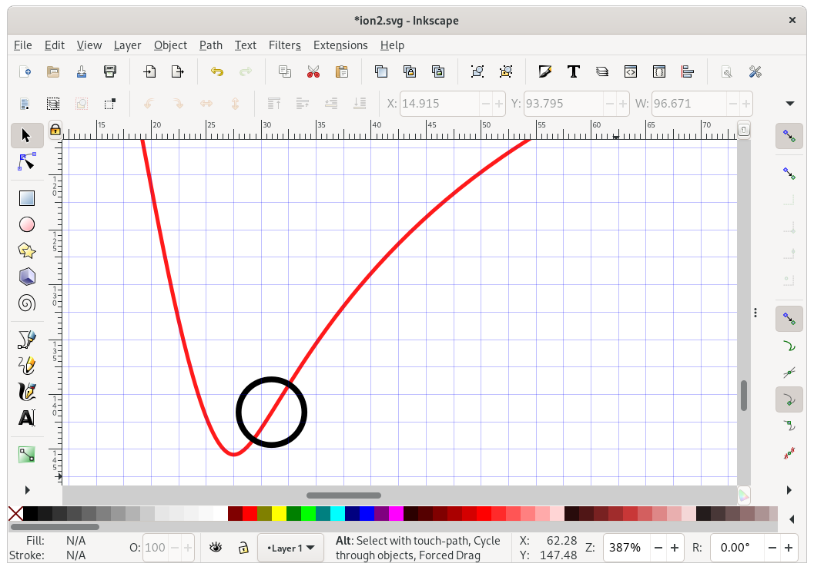

Select the circle and smooth line, and select `Path > Intersection` from the menu:

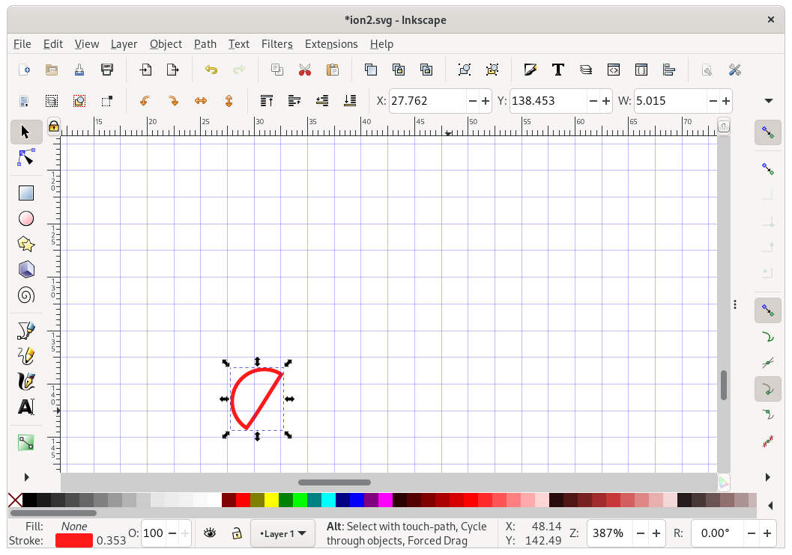

We've created a new path, consisting only of the two object's insersection.
However, it also includes a little bit of circle that we don't need, so we'll need to edit the path to chop it off.
Zoom in (e.g. Ctrl + scroll wheel), select the path editing tool (top left), and click the path:

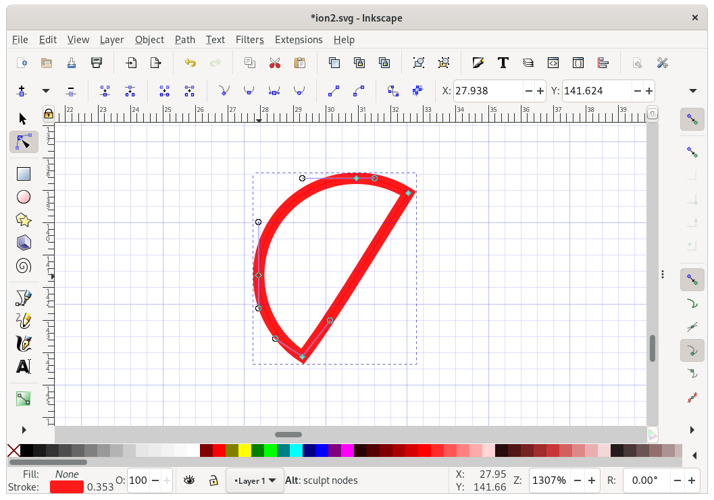

There are two nodes we don't need, and three segments that we want to delete.
The easiest way to go about this is to start by selecting one of the segments we don't want (you can drag it around a bit if you like, to see what you've selected), and then clicking `Delete segment between two non-endpoint nodes`:

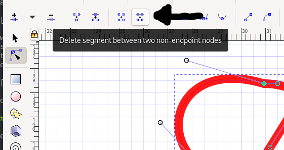

If succesful, you should have made a gap in the line:

Now you can simply select the unwanted nodes and click `Delete selected nodes`:

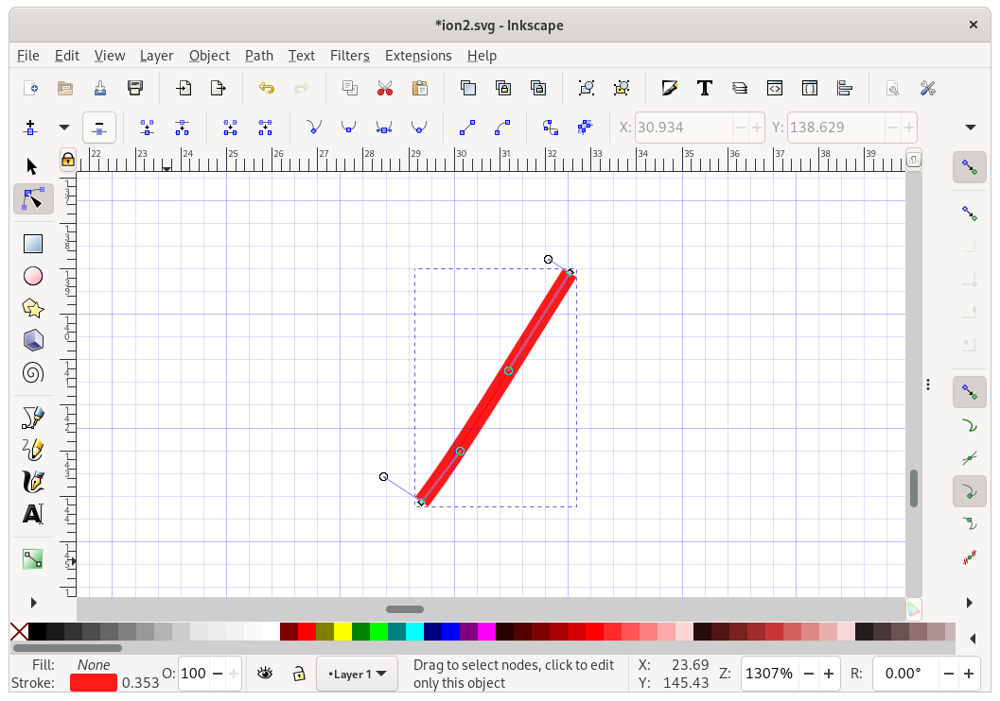

This gives us the line segment we were after.
It looks almost straight in this example!
However, we've also deleted the "magnifying glass" circle in the process.

Scroll over to the original lines, select the circle, copy and paste-in-place, and move it down with `Shift + arrow keys`:

Use the z controls to place the circle "above" the line segment:

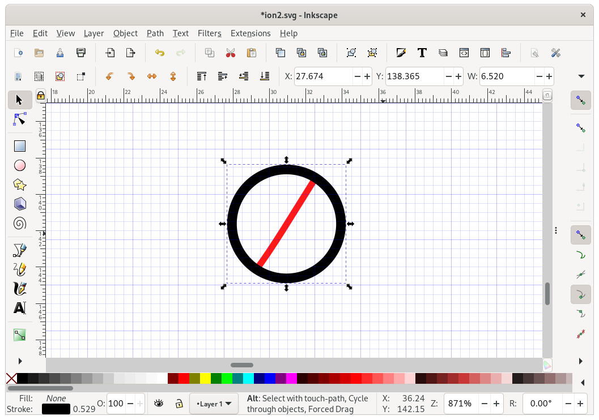

First part done!
Now scroll down to the noisy line, and start repeating the process:

Looks like this one's going to be a little harder...
Set about deleting segments and nodes until you get an acceptable result.
Maybe save the image first and remember you can undo/redo your actions.

I ended up with this:

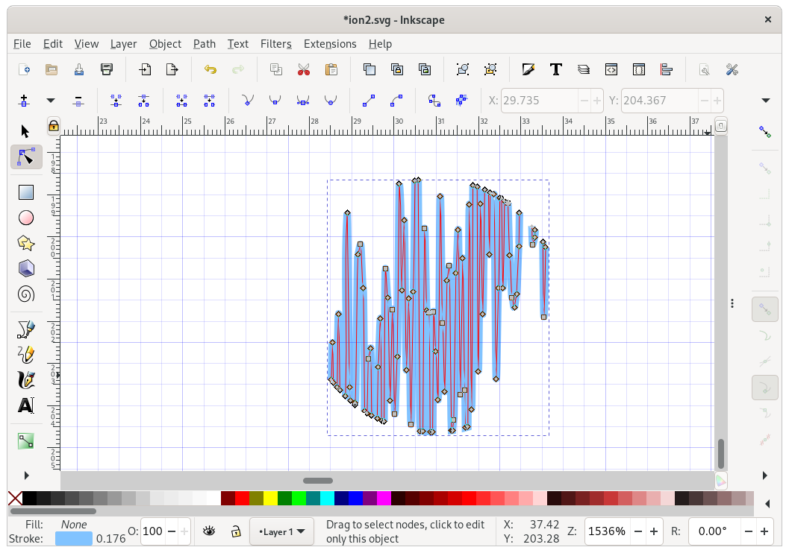

Notice how it's no longer a single continuous line, but Inkscape still considers it one "Path".
(You can change this using the `Combine` and `Break apart` options in the `Path` menu).

Select the path with the cursor tool, and use the arrow keys to move it up, until it overlaps with the smooth line segment.
Use the z-controls to get the ordering right:

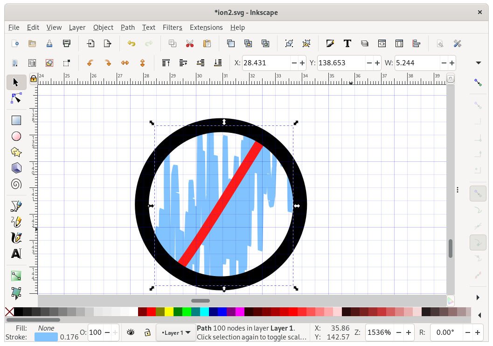

Now select all three parts, and use the transform handles at the side to scale them up!
Drag and drop the new bits to a nice-looking place (you can disable `snap` for this part).

The rescaling has messed with our line widths, so use the `Fill and stroke` dialog to adjust them
In the example below I've deliberately kept the two "data" lines thicker than in the original, to emphasise the idea that this is a zoomed in view.
You may also want to increase the saturation and slightly the noisy trace, to reinforce the idea that we're seeing it up close and in focus now.

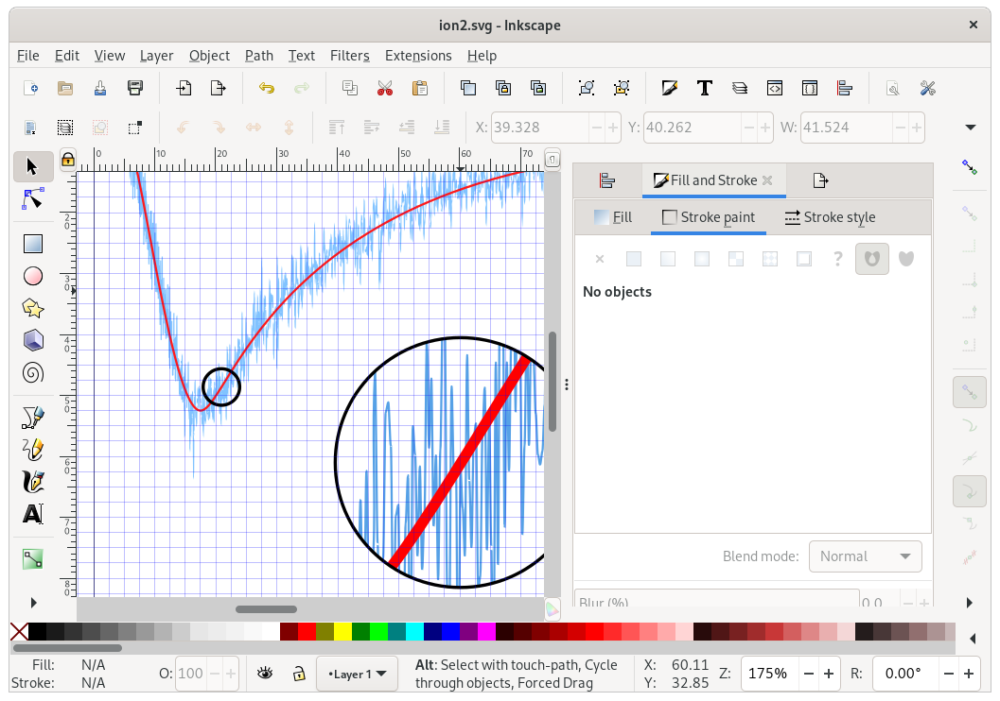

Draw two lines approximately tangential to both circles, and use the copy-style method (`Ctrl+Shift+V`) to give them the same styling as the circles.
This will take a bit of trial and error (and a lot of zooming in and out) to get right.
Make sure you disable snapping for this step!

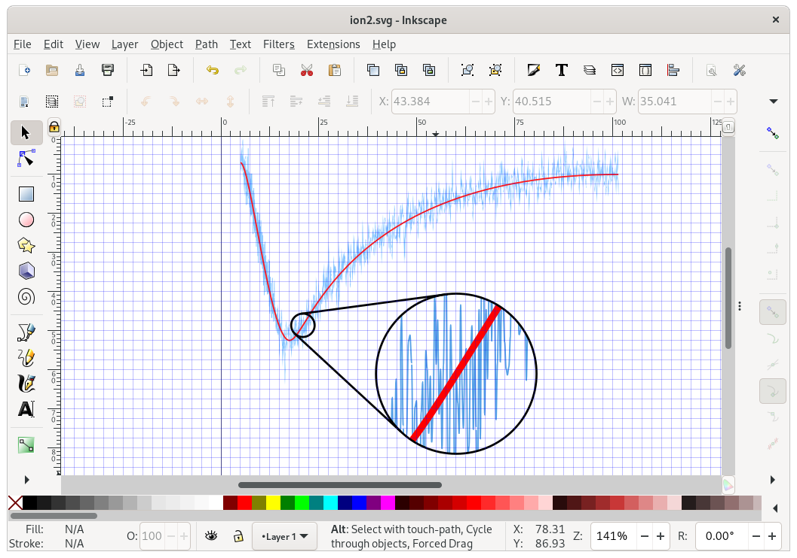

At this stage you might see little white spots in your noisy line.
These can occur where a path overlaps with itself.
Zoom in to see what's going on:

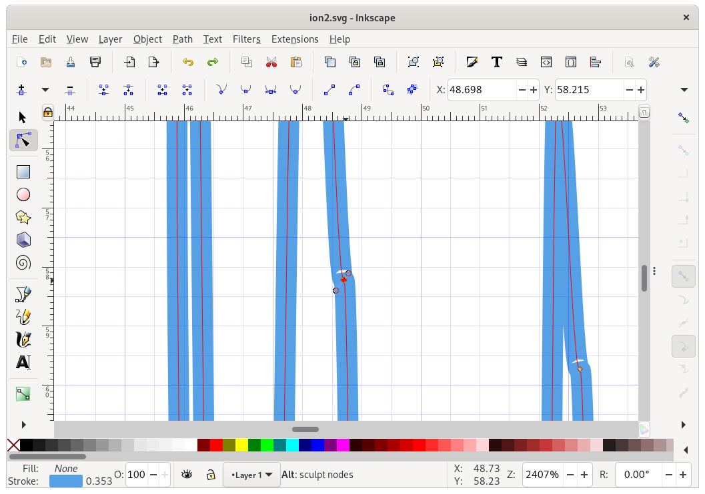

Looks like there's nodes with handles pointing in odd directions.
In some cases you can fix these by selecting the offending node and clicking `Make nodes auto smooth`.
For others it might be better to adjust the handles manually, or delete the node altogether.
Repeat for any little glitches until you are satisfied with the result:

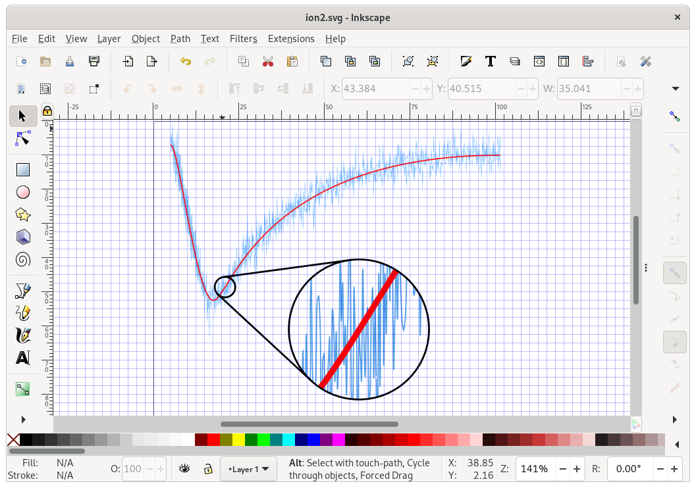

Done!
