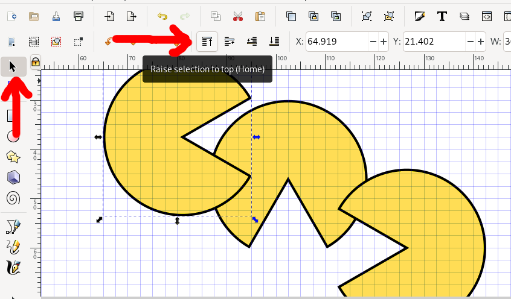

# Inkscape: Moving stuff about

## Mirror, rotate, and flip

Draw a shape, and select it with the cursor tool.
In the top toolbar, you should now see buttons that let you flip, mirror, and rotate your shape:

Make a few copies of your item (remember to use Ctrl+Alt+V if you want to copy the position too), and move them so that they overlap.
You can control which objects is shown on top with the z-index controls, indicated below:

## Snapping

## Distribute and align

## Guides
- Organising
  - Grid
  - Move, snap to different bits
  - Align & distribute
  - Guides

