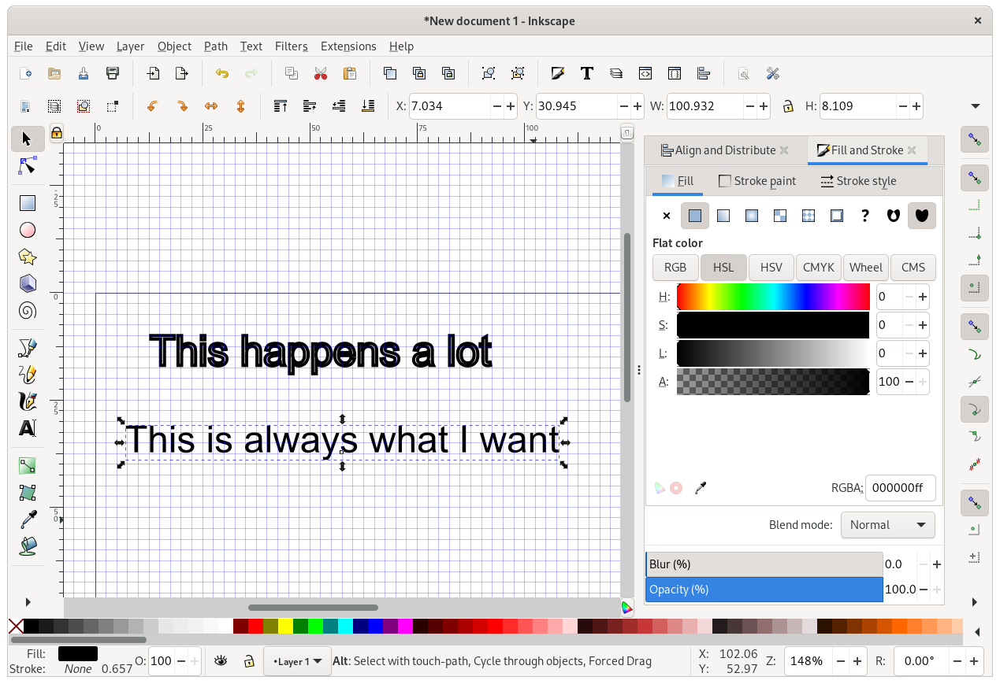
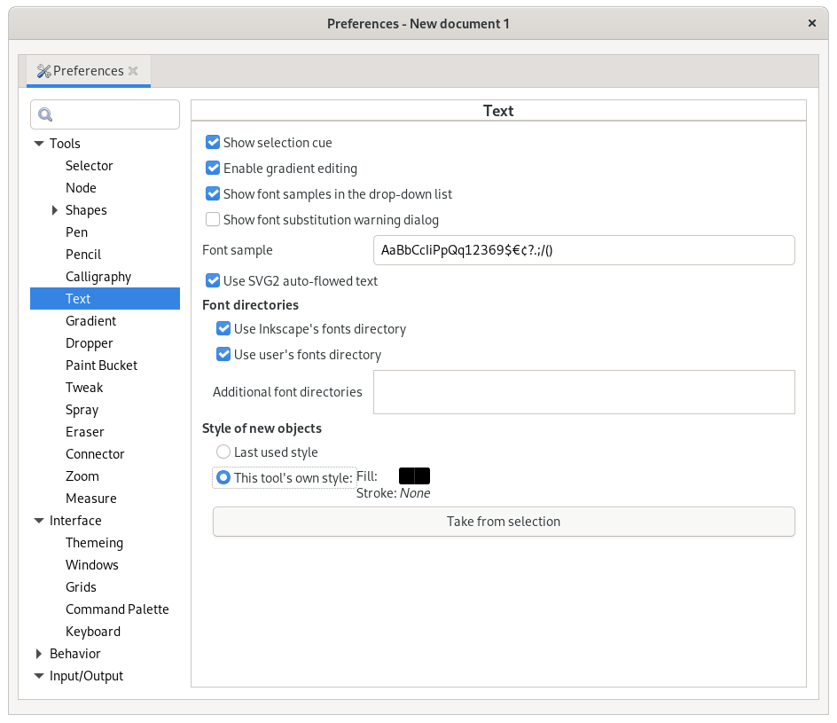
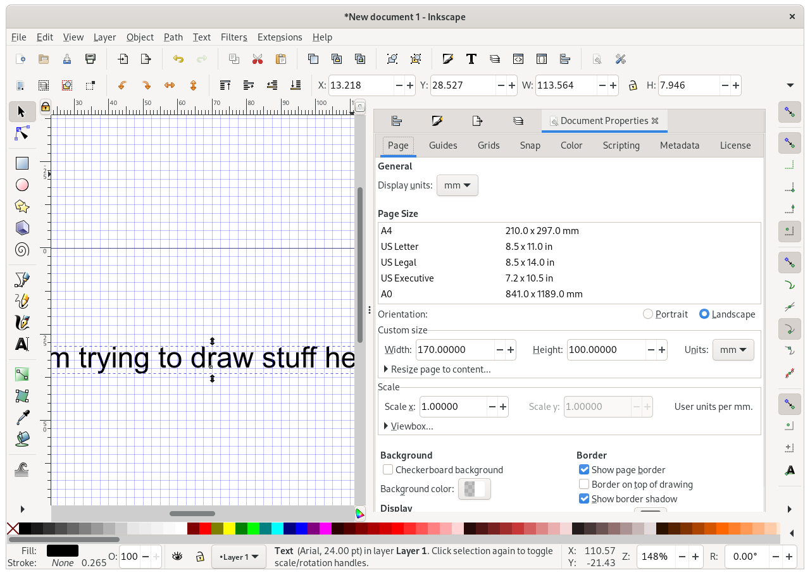
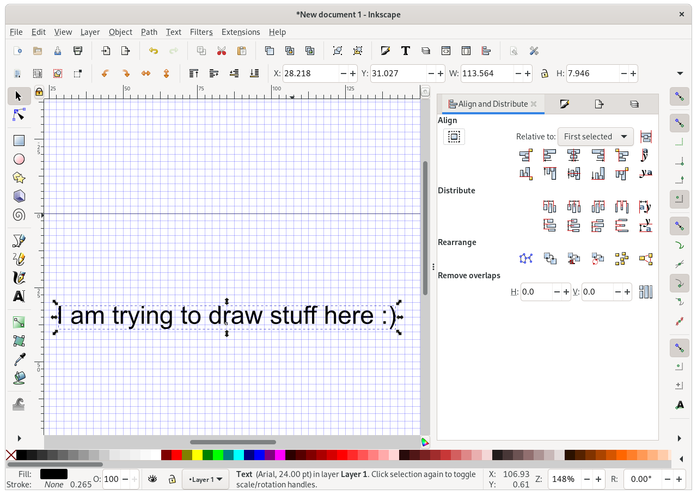

# Inkscape: Annoyances

## Setting a default style per tool (e.g. for text)

By default, Inkscape maintains the "Fill and Stroke" settings when you switch between (most!) tools.
For text, this can be pretty annoying:

Text almost never needs a stroke!
Luckily, we can change this behaviour.
First, add some new text and give it the styling you want.
Next, select the text, and click `Edit > Preferences`.

Now navigate to `Tools > Text` and set `Style of new objects` to `This tool's own style`.
Finally, click `Take from selection` to set the tool's own style to that of your currently selected text.

## Why are those dialogs so massive?

The dialogs on the right of the screen can be pretty huge.
You can toggle them on/off quickly with F12.
But if you try to reduce their size, the dialog quickly folds away:

Why is this?
The answer seems to be that the dialog panel takes its minimum size from the dialogs it contains, and so the minimum size depends on which dialogs are open.
A bit of trial and error shows that `Document Properties` is the main culprit,

Once you shut the `Document Properties` dialog, the panel can be reduced to a much smaller size.

