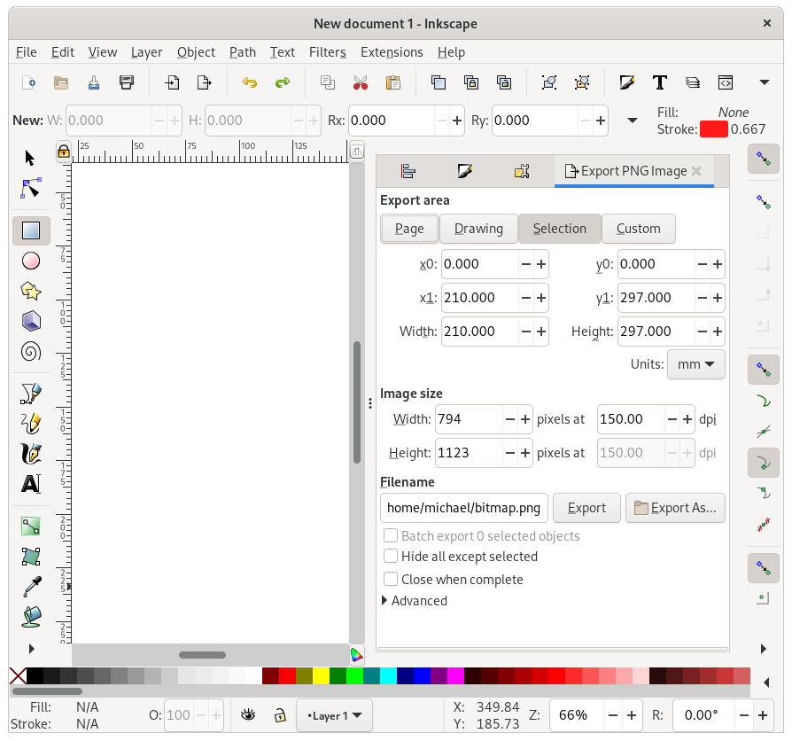

# Inkscape: Save and export

Inkscape's default file format is "Inkscape SVG (.SVG)".
This is a normal [SVG file](https://en.wikipedia.org/wiki/Scalable_Vector_Graphics) with some extra inkscape annotations.
Other software ignores the inkscape part, so you can happily save as "Inkscape SVG" and pass your work to any tool that accepts SVG (including most browsers).

## Saving as PDF

PDF documents can contain vector graphics, and Inkscape can read and write them.
Because it actually stores the vector information in the PDF, Inkscape calls it "saving" to PDF rather than "exporting" to PDF.

### Importing PDFs

Importing PDFs can be tricky, but is very useful.
For example if you need to modify a PDF, for any reason.

This is also useful if you want to use equations in your Inkscape diagrams: simply make a blank latex document, add your equations, render as PDF, and then import the PDF with Inkscape.

Inkscape gives you two options to import "Internal" or "Poppler/Cairo".
Poppler usually works best, but if it gives strange results may try internal too!

### Saving as EPS

A lot of journals want their vector art in EPS file. 
EPS stands for [encapsulated postscript](https://en.wikipedia.org/wiki/Encapsulated_PostScript), and is closely related to PostScript and PDF.
A few key differences between EPS and PDF:

- EPS is meant for smaller documents
- EPS has no concept of a "page" or "bounding box": any whitespace surrounding the objects in your drawing will disappear if you save as EPS.
- EPS does not support some features, e.g. transparency.

If you were using transparency just to get a lighter colour: render your image and use a colourpicker to get that colour value and just use it directly.
If you were using transparency in a more meaningful way, you're options are (1) redesign to avoid transparency or (2) submit a rasterised version of your art.

If you're desperate for whitespace in your EPS, add a rectangle the same size of your page, and use the z-index controls to move it to the background.
You may want to "lock" this rectangle (`Object > Object properties > Lock`) so that you don't accidentally select it all the time.

## Exporting as PNG

PNG is a versatile, open format that supports lossless and lossy compression.
While JPGs are the preferred format for scancs and photographs, PNG is more suitable for line drawings.
It also supports transparent backgrounds.

To export a PNG, go to `File > Export PNG image`

This opens a dialog (usually on the right) with several options.

Near the top, you can select `Page`, `Drawing`, `Selection` or `Custom`, which controls the objects that will be exported.
Most of the time, you'll want to set this to `Page` (although Inkscape loves changing your settings to `Selection`).

In the fields below, you can specify the resolution at which the vector graphics will be rasterised, either by setting a DPI value or by specifying the desired pixel dimensions.

Finally, you can set a filename (either manually or via `Export As...`) and hit `Export` to save.
A nice feature of Inkscape is that it remembers the path you exported to, so repeated exporting is easy.
